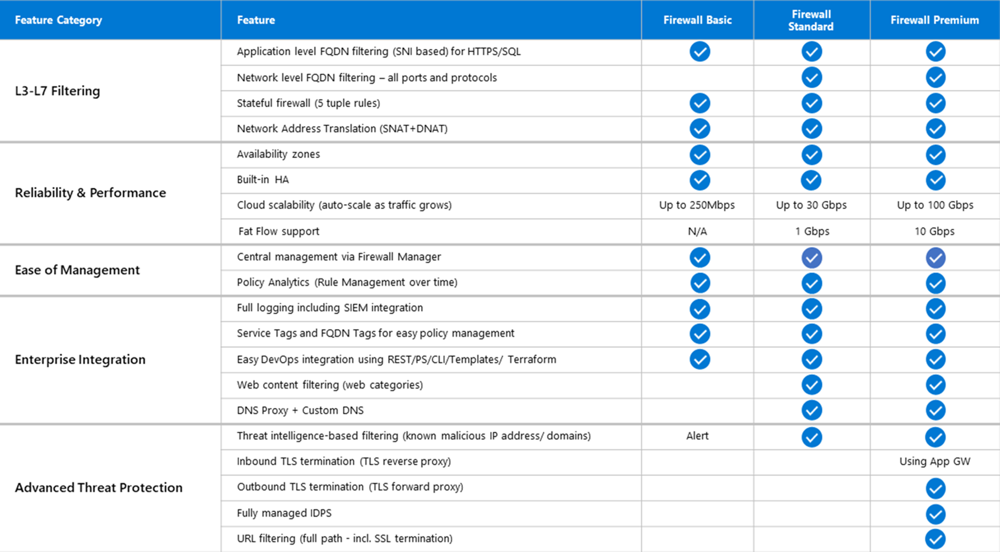
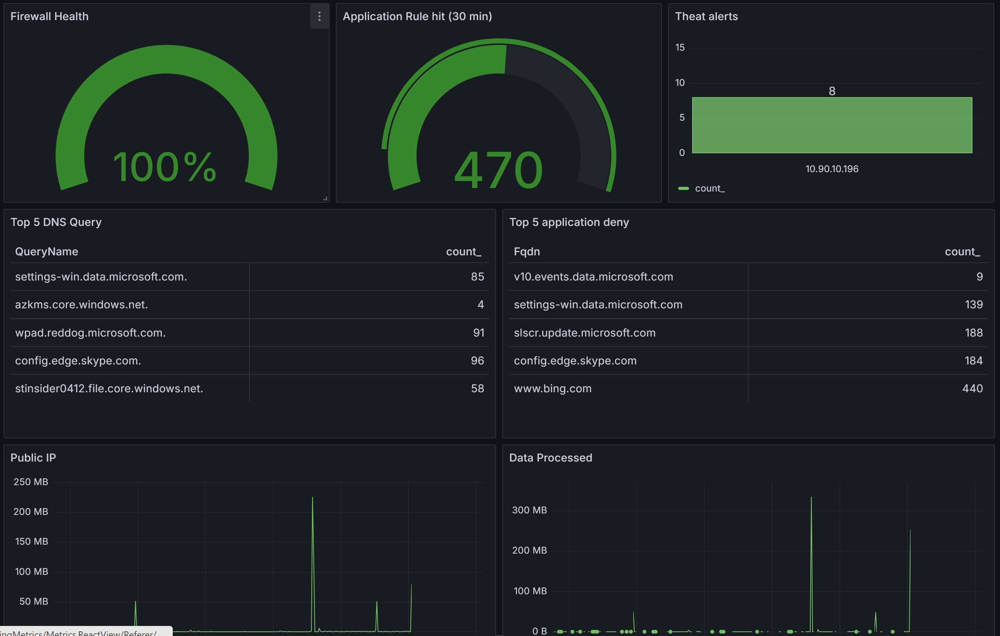
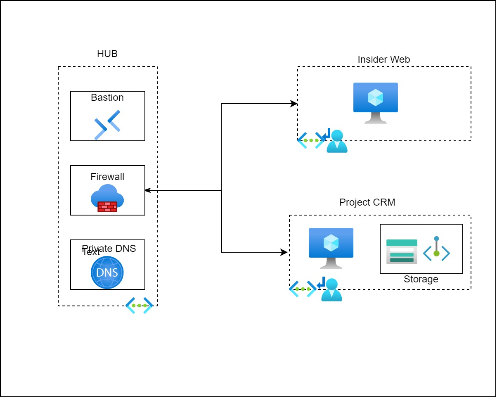

05.12.2024

 
 

## Azure Firewall 
####  Secure your cloud infrastructure

---
 

#### Agenda:
* What is Azure Firewall?

* Key Features and Editions
  
  * Threat Intelligense
  * Dns Proxy  

* Rule Deployment Options

* Pricing
 
* Monitor

---
 

#### What is Azure Firewall?

* Cloud native stateful firewall

* Built-in high availability

* Unrestricted cloud scalability

* Threat intelligence and IDPS

* Application FQDN filtering rules

* DNS proxy 
  
* Web Proxy

--- 
 

#### Key Features and Editions

 

---
 

#### Threat intelligence 

* Filtering works by leveraging the Microsoft Threat Intelligence feed to identify and block traffic from/to known malicious IP addresses, domains, and URLs. Here's how it operates:

* Alert and Deny Modes: If a rule is triggered, you can choose to log an alert or block the traffic (alert and deny mode). 

* Allowlists: You can configure allowlists to prevent false positives by specifying IP addresses, ranges, or subnets that should not be filtered.

---
 

#### DNS Proxy

* Forward DNS to configured DNS Server
* Ensures that DNS requests from clients are resolved consistently
* Azure Firewall caches DNS responses according to the TTL

  

---
 

#### WEB Proxy (Preview)

* By default, Azure Firewall operates in transparent proxy mode
* Azure Firewall can operate in explicit proxy mode, where traffic is sent to the firewall using proxy settings
* Proxy Auto-Configuration (PAC) File
* UDR not needed in explicit proxy mode
  
---

 
 

#### Firewall policy update

* Update Policy using Azure Portal
* Update Policy using Bicep, Terraform or Arm
* Decentralized Policy update in Landing Zone Project
_
---
 

#### Azure Firewall Policy

---
 

#### Azure Firewall Policy Update

 
 

---

 

 
 
 
 

# DEMO
 
---
 

#### Pricing

 

  
 

---
 

#### Monitor

 

 ---
 

#### 

 
