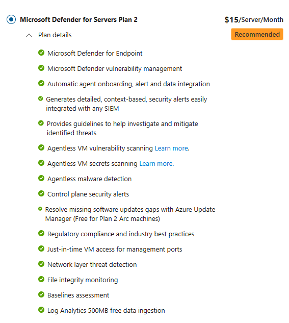
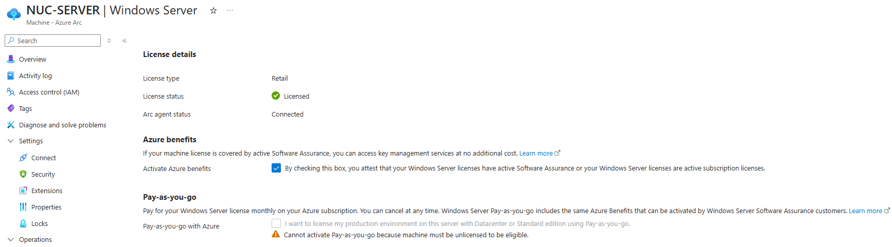

## Azure Update Manager

---

 

 

##### Gik i GA (General Availability) i september 2023

---

 

#### Hvordan var reglerne

- Ved introduktionen af Azure Update Manager var prisen pr. on-premises server $5 pr. måned
(forudsat at serveren ikke var dækket af Defender for Server Plan 2)

---

 

#### Hvad er det nye

- Såfremt kunder har Software Assurance (SA) dækning på deres Windows Server licenser 
- eller licenseret dem via Software Subscriptions (CSP)

--- 

 

## DEMO

- Activate Azure benefits - Arc VM
- Cost Management
- Resource Graph Explorer
