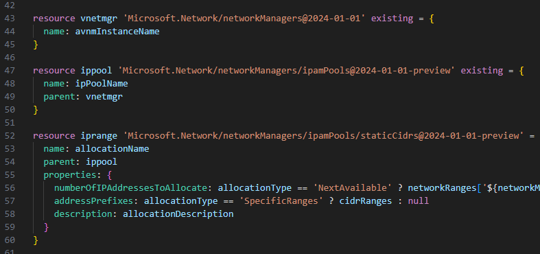
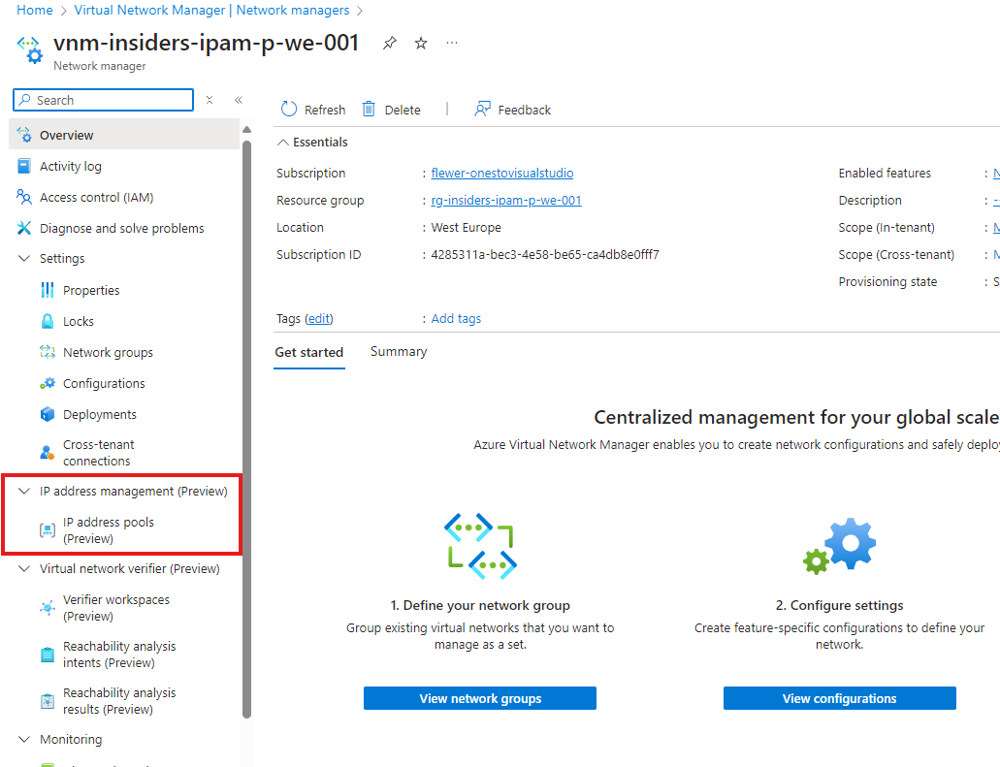
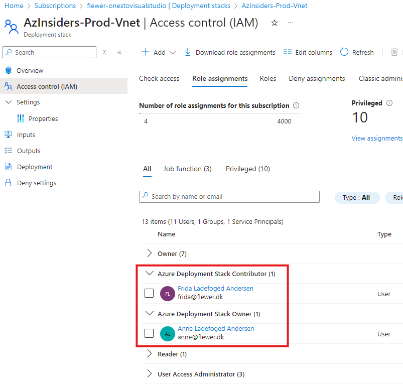
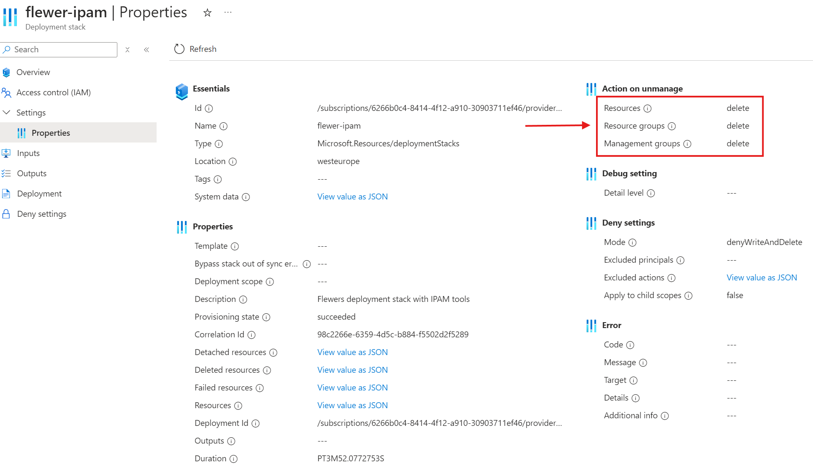
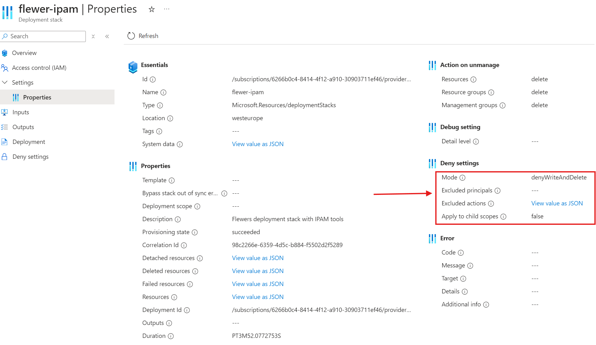
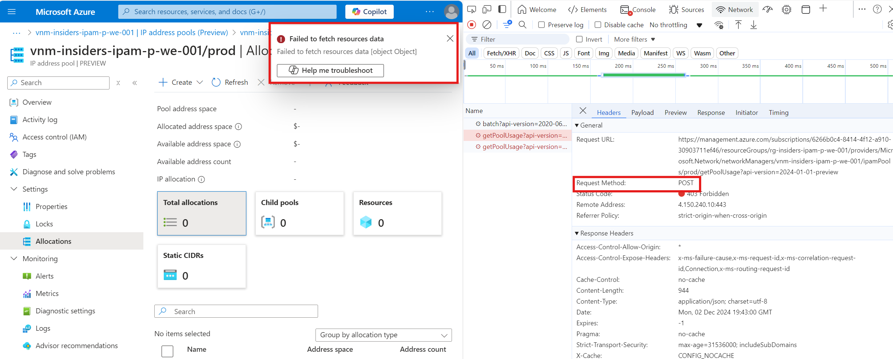
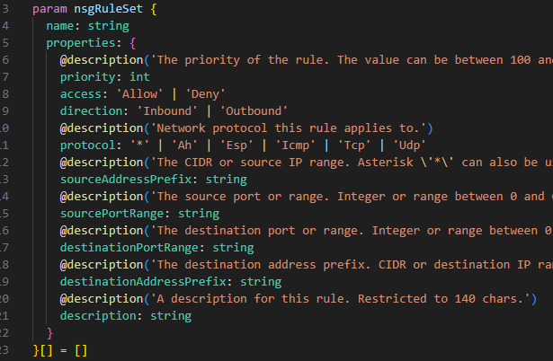

# Bicep Tools & Good Practises

---

## IPAM

- IP Address Management - Tech Preview
  - Ny feature i Virtual Network Manager
- Opret IP Pools
- I IPAM associeres ressourcer med en pool
  - Når nyt netværk oprettes i VNM, tildeles automatisk IP-range

---

## IPAM

- Store scopes kan inddeles i mindre pools
  - Eks. pool "Azure uber range" "100.100.0.0/16" inddeles i:
    - Prod: 100.100.0.0/18 (100.200.0.0-100.100.63.254)
    - Test: 100.100.64.0/18 (100.200.64.0-100.100.127.254)
    - Dev: 100.100.128.0/18 (100.200.128.0-100.100.191.254)

---

## IPAM

- Der kan oprettes "Static CIDRs"
  - Dvs. "reservere" en block
  - Det kan gøres med Bicep
  - Og BRUGES I BICEP!

---

## IPAM

- Pricing
  - VNM afregnes ift. antal vNets og NSG's under kontrol
  - Ingen pris på IPAM tool (endnu)
  - Microsoft: "a reasonable price point"
    - if any price at all

---

## IPAM Demo!

- Intro til IP Pools (Portal)
- Opret Static CIDR block
- Bicep kode til Static CIDR block
- Opret reservations
  (demo 1)
- Opret vNet (demo 2)

---

## Azure Deployment Stacks

- Sikre "True Infrastructure as Code"
- Sæt rettigheder på deployment stack
  - hvem må opdatere stack'en?

  

---

## Azure Deployment Stacks

- ActionOnUnmanage
  - DetachAll
    (efterlad ressourcer)
  - DeleteResources
    (slet ressourcer)
  - DeleteAll
    (slet ressourcer og resource group)

---

## Azure Deployment Stacks

- Bloker for ændringer / sletninger i Portal
- DenySettingsMode
  - None
  - DenyDelete
  - DenyWriteAndDelete
  - ApplyToChildScopes

---

## Azure Deployment Stacks

- DenySettingsMode
  - None
  - DenyDelete
  - DenyWriteAndDelete
  - NB: Pas på med DenyWriteAndDelete!

---

## Azure Deployment Stacks Demo!

- Kig på Deployment Stack
  - DenyWriteAndDelete
- Ændre nsg rule (error)
- slet route i RT (error)
  - Bemærk det er child-resource
- Disassociate RT 
  (error pga DenyWrite)

---

## Azure Deployment Stacks Demo!

- Opdater bicep (demo 3)
  (ipam\main_vNet.bicep)
- Se at NSG'er slettes helt

---

## Azure Deployment Stacks Demo!

- Opdater Stack (demo 4)
  - DenyDelete
- slet route i RT (error)
- Disassociate RT
  - Bemærk det går godt!
  - Ændringer i subnet tillades

---

## Bicep good practice - moduler

- Intro til strategier:
  - "generiske moduler"
    - Alt er parameteriseret
  - "faste moduler"
    - Ingen eller meget få inputs
    - Ressourcen bygges altid på samme måde
  - "Configuration Sets"
    - ex. environment (prod/test/dev)
    - Vælg SQL DTU og backup retention ud fra environment

---

## Bicep good practice - moduler

- Moduler bør være lette at teste
  - 1 modul står for 1 ressourcetype
  - måske et par understøttende ressourcetyper også
  - eks. AppService bør adskilles fra AppServicePlan
    (flere AppServices pr. plan)
- Overvej navngivning af ressourcen i selve modulet
  - Håndter min/max længde
  - Håndtér "global uniqueness" vha. UniqueString suffix

---

## Bicep good practice - moduler

- Brug module outputs
- Output gerne Resource Id
  - Brug det til sammenkædning af moduler
  - Skaber en implicit dependency, 
    hvilket styrer execution order

---

### Bicep good practice - variabler

- Brug variabler til
  - "konstanter" som ikke ændrer sig
  - Expressions, eks. sammensætning af navn
- Variabler gør koden lettere at læse
  - Og de er lette at genbruge

---

### Bicep good practice - parametre

- Brug parametre til input der ændrer sig
- Overvej at undlade "name" som parameter
  - Men beregn den i stedet (variabel) ud fra
    - "sysId" (short system name)
    - environment (prod/test/dev)
    - location
    - UniqueString

---

## Bicep good practice - decorators

- Brug altid decorators, det gør modulet let at arbejde med!
  - @description
  - @allowed
  - @min
  - @max

---

## Bicep good practice - type declarations

- Type declarations gør moduler lækre!
- Eks. en NSG rule, er et custom input object
- Uden type declaration:
  - Bruger af modulet skal "gætte" sig til syntaxen
  - Eller kigge i modulet

---

## Bicep good practice - type declarations

- Type declarations og 
  CTRL-SPACE styrer :-)

---

## Bicep good practice - DEMO

- Kig i:
  - .\bicep\Modules\simpleModule.bicep
  - .\bicep\main.bicep
- Kør demo 5

---

## Bicep good practice - DEMO

- Kig i:
  - .\bicep\Modules\smartModule.bicep
  - Brug modulet i .\bicep\main.bicep
  - Bemærk brugen af type-declarations
  - Kør demo 5

---

## Bicep good practice - DEMO

- Brug NSG modul i .\bicep\main.bicep
- Bemærk værdien af type-declarations og decorators
- Kør demo 5

