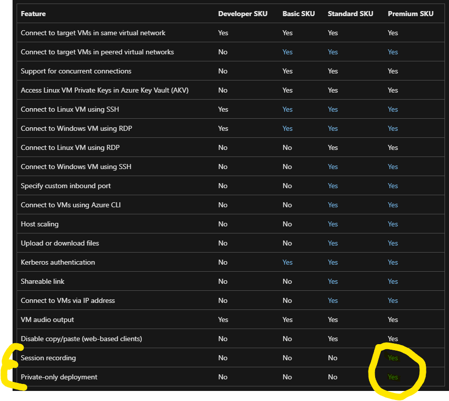
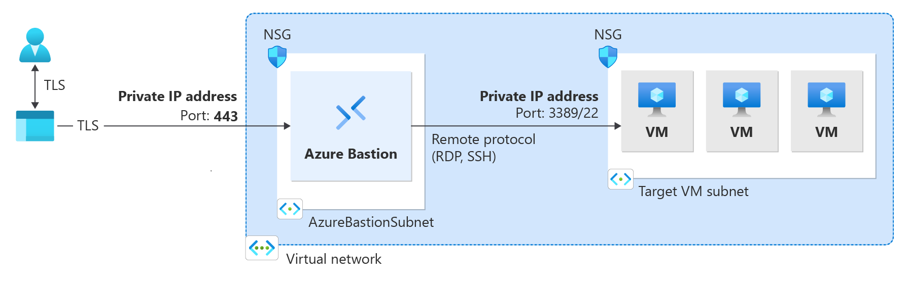
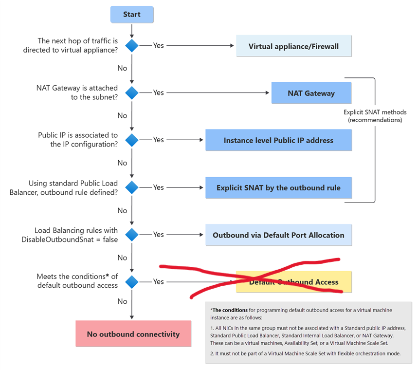
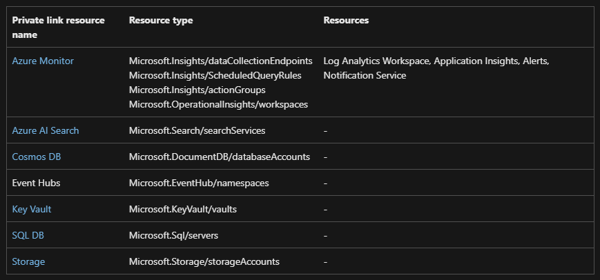
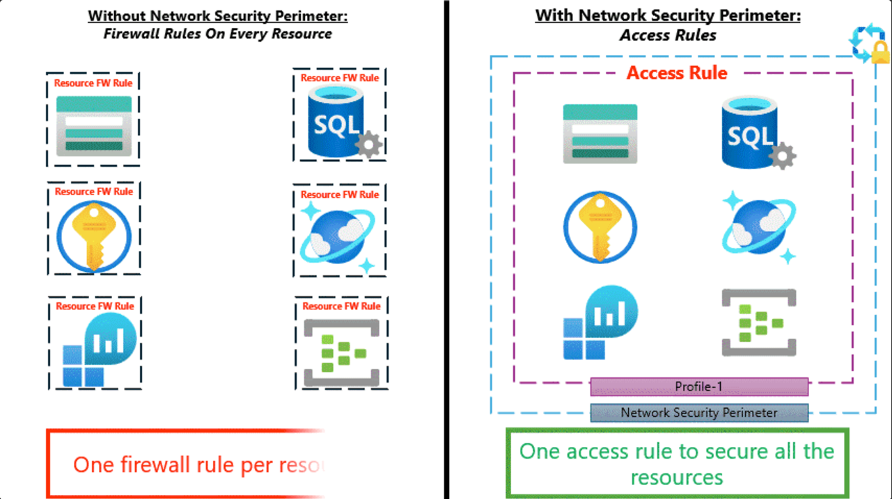
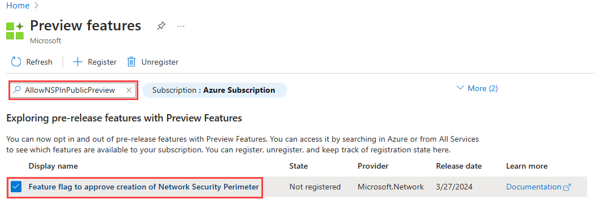
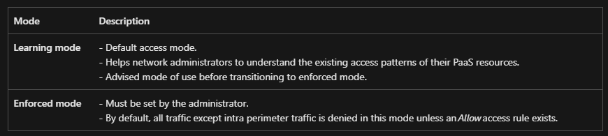
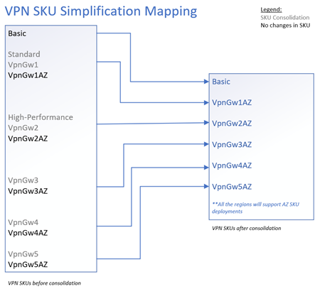

## Networking News

---

 

 

#### - Bastion Premium
#### - Private Subnet
#### - Network Security Perimeter
#### - Azure Virtual Network Gateway SKU consolidation

---

 

#### Bastion Premium:

 

- RDP og SSH forbindelse til Azure miljøer, via TLS over HTTPS

- Bastion Premium, nu GA (General Availability)

---

 

 

---

 

##### Private-only deployments

 

 

---

 

##### Session recording

- Når en session lukkes eller disconnectes - bliver sessionsoptagelsen gemt i en Storage Blob
- Virker ikke med native klienten endnu (altså kun web)
- Samtlige sessioner via Bastion Hosten optages

---

 

## DEMO

- Forbind VM via Bastion Premium / Invoke-WebRequest
- Vis session recording
- Husk CORS regler på Blob Storage

---

 

#### Private Subnet:

 

- Secure by default | kun adgang til outbound i un-peered netværk hvis det er nødvendigt
- "On September 30, 2025, default outbound access for new deployments will be retired."

---

 

##### Decision tree ift. behov for default outbound access

 

---

 

## DEMO

- Forbind VM i private subnet via Bastion Premium / Invoke-WebRequest

---

 

#### Network Security Perimeter:

 

- Central styring af Public Network Access til PaaS services (data tier services)  

- Gået i Public Preview i november

---

 

##### Hvordan virker det

 

- PaaS services associeres med en Network Security Perimeter ressource

 

---

 

#### Hvordan virker det

 

- Da det er er public preview skal man huske at registrere preview featuren

 

---

 

#### Hvordan virker det

 

- 2 access modes: Learning og Enforced - defineres pr. resource

---

 

#### Hvordan virker det

 

- Der laves Access Rules for inbound og outbound trafik, associeres med en profil

 

- Inbound: skal indeholde tilladte sources enten public IP adresser eller subscriptions
- Outbound: skal indeholde tilladte destinations angivet som FQDN

---

 

## DEMO

- Draw.io diagram over setup
- Vis Network Security Perimeter ressource
- PaaS service Public Access ("publicNetworkAccess: 'SecuredByPerimeter'")
- Vis forbindelse via portal (update Access Rule)
- Vis forbindelse til SQL via Private Endpoint / VM i Private Subnet 
- Vis Log Analytics (virker kun i US datacentre)

---

 

#### Azure Virtual Network Gateway SKU consolidation

 

- Startende fra 1/1-2025 kan der ikke længere laves nye deployments af VpnGw1-5 

- Fra april 2025 til september 2026 vil alle eksisterende non-Az SKU gateways migreres 

---

 

##### SKU mapping

 

