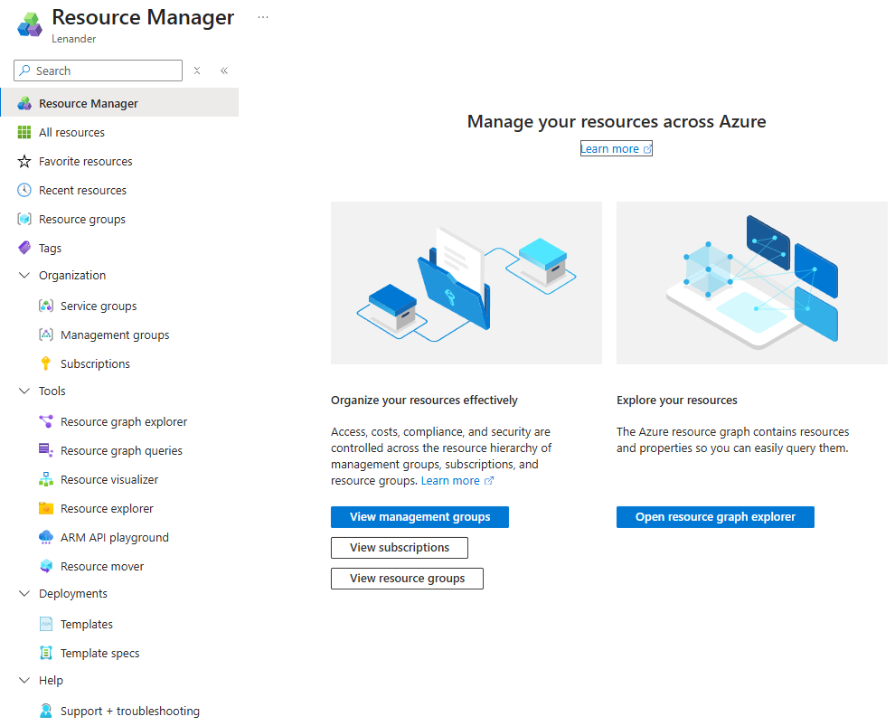
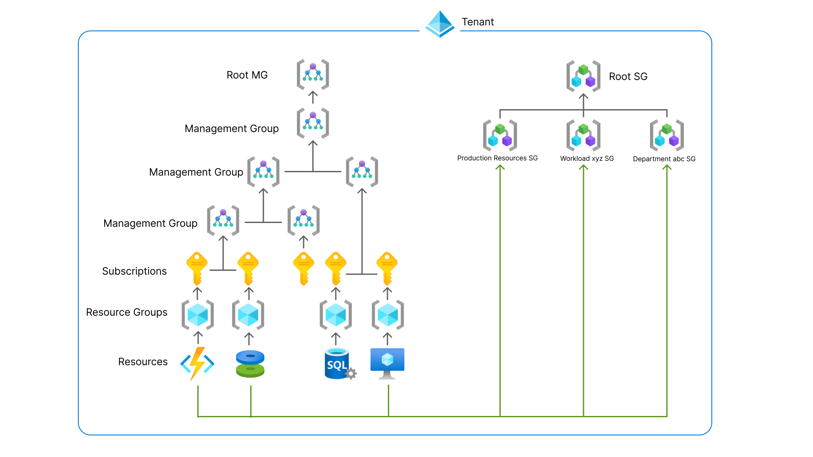
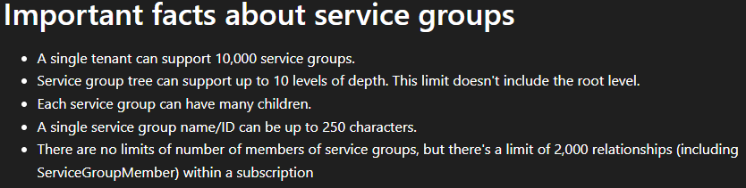
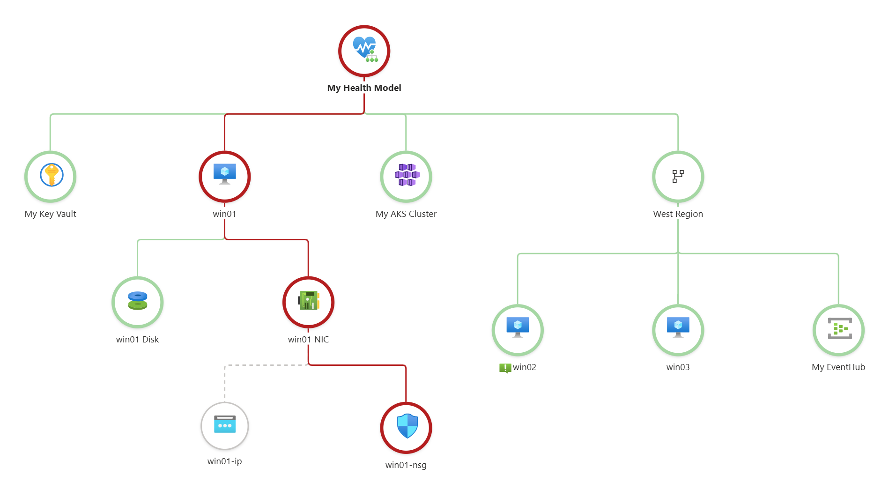
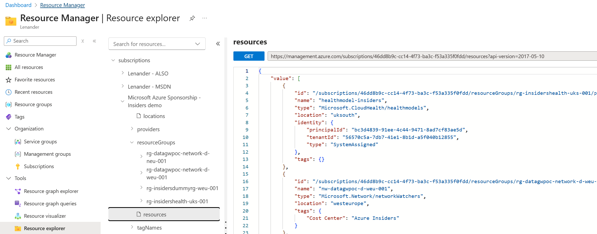
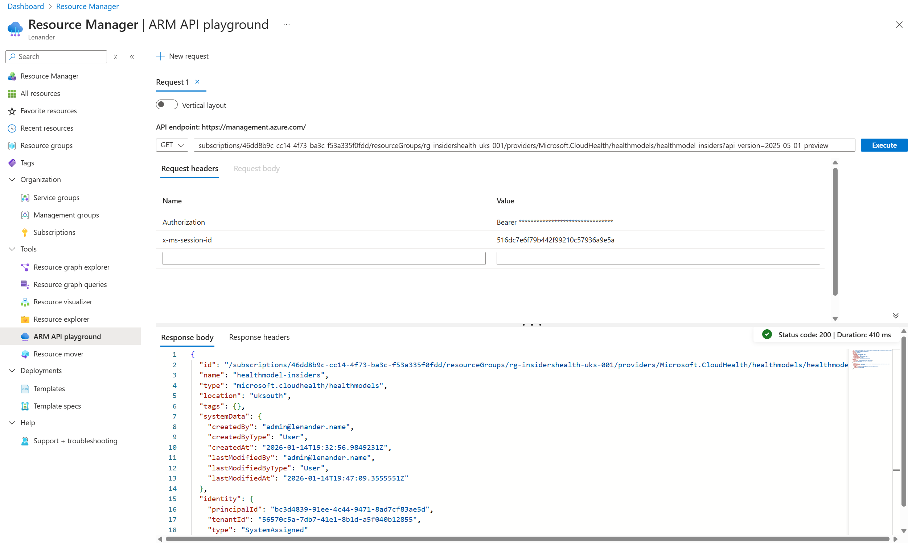

15.01.2026

 
 

## Nye features i Azure Portal (ny-ish)

 

---

 

### Features
Resource Manager
    • Service groups
    • Resource Explorer
    • ARM API playground
 

---

 

### Resource Manager 
Ny samling af ressourcerelaterede features som vi bruger tit
 

 

---

 

#### Service groups
Ny governance feature
• Ressourcegruppering på tværs af subscriptions (funktionelt view)
• Kan tildeles roller således at least-privilege brugere se de grupperede ressourcer
• Preview - Monitoring
    - Issues | Application Maps (Application Insights) | Monitoring coverage and recommendations (VM og AKS)

 

---

 

#### Service groups
Kan ikke bruges til:
    • Som deployment scope
    • Policy scope
    • Role assignment scope
Kan bruges til tværgående health monitoring
 

---

 

#### Service groups
Azure Health Model
    

 

---

 

### DEMO 

 

---

 

#### Resource Explorer
Azure Resource Manager REST API (JSON view)
 
 

---

 

#### ARM API playground
Direkte interaktion med management.azure.com ARM‑API’er
Mulighed for at udføre live GET/LIST/POST/PUT/PATCH/DELETE‑kald i et sandbox UI
 
 

---

 

### DEMO 

 