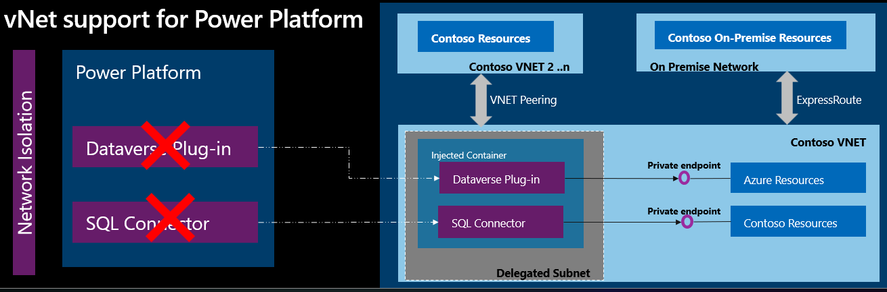
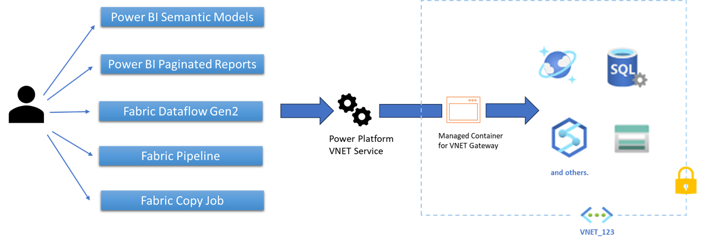
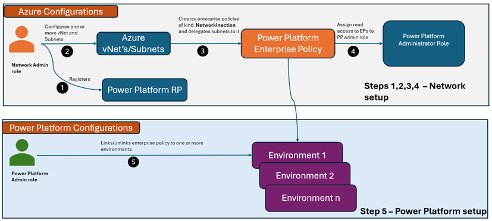
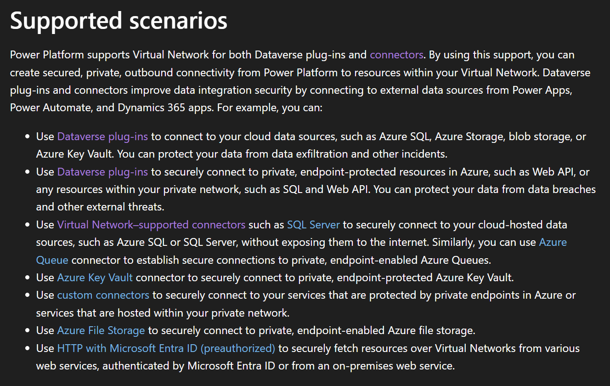
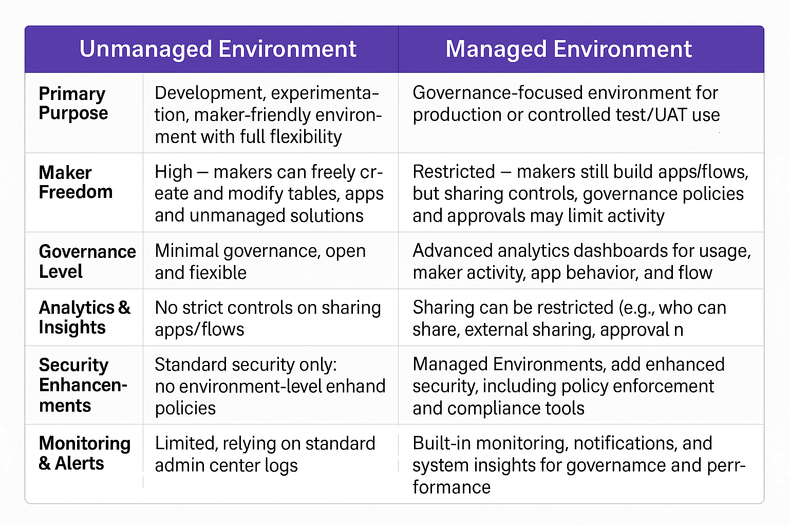
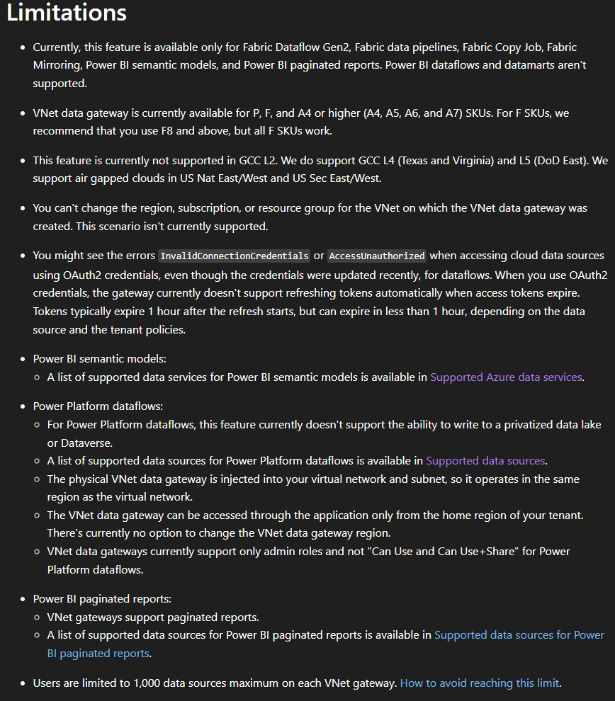
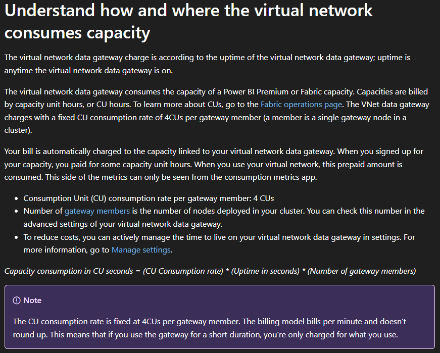

15.01.2026

 
 

## VNET Integration fra Power Platform og Fabric

 

---

 

#### "vNet support for Power Platform" og "Virtual network data gateways"
Er der nogen som allerede bruger det ene eller det andet?

 

---

 

#### "vNet support for Power Platform" og "Virtual network data gateways"
Hvad er det
    • Managed (Microsoft) integration ind i Azure VNET
vNet support for Power Platform |   Virtual network data gateways
&nbsp;&nbsp;&nbsp; 

 

---

 

#### "vNet support for Power Platform" og "Virtual network data gateways"
Hvorfor
    • Governance krav
    • Corp Landing Zones der kun tillader private endpoints
    • Styring af netværkstrafik

 

---

 

#### "vNet support for Power Platform" 
Hvordan
    • Power Platform kræver et VNET for hver Azure region i en Power Platform region
    • Kræver et managed environment

&nbsp;&nbsp;&nbsp;&nbsp;

 

---

<!--  

#### "vNet support for Power Platform" 
Managed vs Unmanaged environment
    
 

 

--- -->

 

#### "Virtual network data gateways"
Hvordan
    • Kræver Fabric kapacitet

 

---

 

#### "Virtual network data gateways"
Hvordan
    • Kapacitetsforbrug

 

---

 

### DEMO 

 