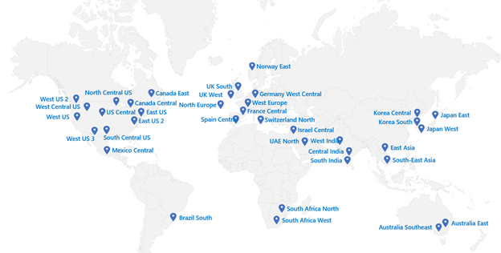
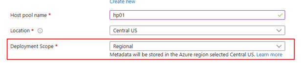

15.01.2026

 
 

## Azure Virtual Desktop - what's new

---

 

 • Azure Virtual Desktop regional host pools (preview)

          
New “regional” infrastructure is slowly being enabled globally, and individual or small numbers of regions will become available periodically over time.

---

 

### Session host placement
 • Azure
 • Azure Local
 • Hybrid deployment using Azure ARC (Private Preview)

---

 

### Session host update (preview)
 • Standardized, Session Host Configuration
 • Image-Based Lifecycle Management 
 • Schedule Updates 
 • Supports Automated Customization 

--- 

 

### Session host update (preview)
 • Cannot use private endpoint with configuration storage account
 • Update replaces host  
 • No previous image

---

 

### DEMO

---
 

### Guest User and FSLogix 

 • Use Guest accounts for AVD
 • Profile storage for guest accounts 

---

 

### DEMO

---

 

### Windows 365 / frontline

 • Dedicated 
 • Shared 

