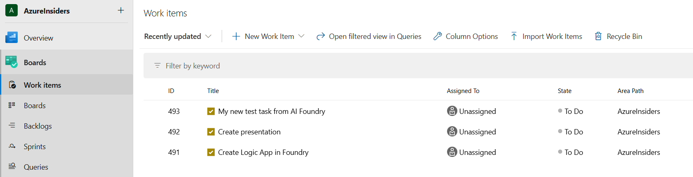
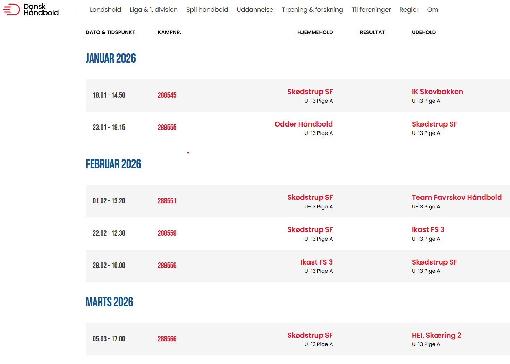
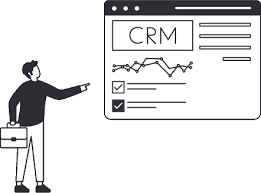
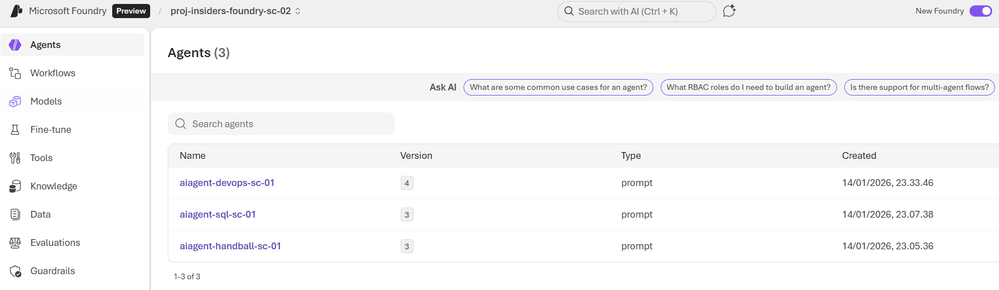
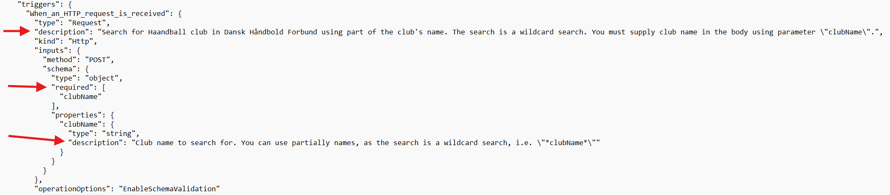
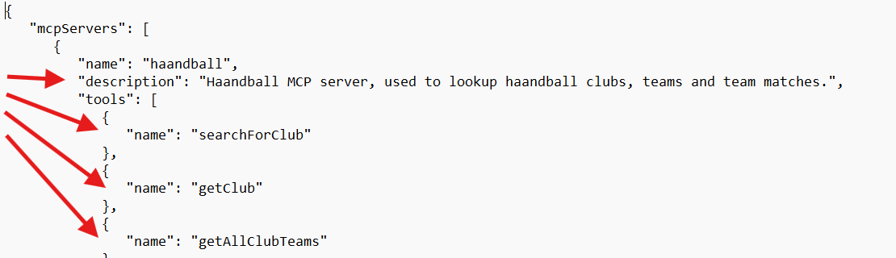

15.01.2026

 
 

# Azure Logic Apps & Functions in an AI world 
# (something about AI and MCP servers)

---

# TOPICS

- Dagens cases
- MCP Server & friends - Hurtig indflyvning
- MCP Server for Azure Logic Apps & Functions technical preview
- DEMO:
  - MCP Server & Azure Logic Apps connectors
  - Azure Logic Apps Custom MCP server
  - MCP Server for Data Api Builder (SQL)

---

# Case #1

- Vi bruger Azure Devops til opgavestyring
- Jeg gider ikke gå ind i portalen hver gang...
- Men Copilot kan ikke snakke med DevOps!

---

# Case #2

- Jeg er aktiv håndbold-far, 
  tjekker kampprogrammet dagligt
- Jeg gad godt spørge CoPilot, men...

---

# Case #2

- https://danskhaandbold.dk/ 
  henter dynamisk data via API
- Copilot kan ikke hente realtime data 
  => Forkerte svar :-(
- Lystrup IF spiller da ikke i blå!

---

# Case #3

- Vores (fiktive) kundedatabase er baseret på Ms SQL
- Jeg vil gerne kunne hente kundelisten direkte fra Copilot
- På sigt vil jeg også godt have en egen-udviklet chat-bot til det

---

# MCP Server & friends

**LLMs**
- Sprog-modellen, f.eks. GPT 4.1
- Der findes mange modeller, og hver har sine styrker
- Bruger interagerer med LLM, eks. Copilot

---

# MCP Server & friends

**Agents**
- LLM kan uddelegere til en Agent; en LLM med bestemte kompetencer, system prompt osv.
- LLM vurderer user input, vurderer hvilken agent der skal delegeres, samler output og returnerer til brugeren.
- Agenten overholder fastsatte politikker, prompts osv. 

---

# MCP Server & friends

**Tools**
- Agents kan gøre brug af tools
- Et tool kan f.eks. være en MCP connection

**MCP**
- MCP = Model Context Protocol
- En standard for kommunikation mellem LLMs, agents & tools
- MCP = USB-C for LLMs

---

# MCP Server & friends

**Ai Foundry**
- Azure "Ai Playground"
- Native Azure resource
- Pro-code, fully customizable

---

# MCP Server & friends

**Ai Foundry**
- Hierarchy:
  "Foundry --> Project"  ...eller  "Foundry --> Hub --> Project" 
- Foundry Hub tilføjer central governance

---

# MCP Server & friends

**Copilot Studio**
- Lever i "Power" verdenen
- Mere low-code agtig
- Til simple scenarier
- Eks. lav hurtigt din egen copilot (aka Agent)

---

# MCP Server and Azure Logic App Connectors

- Meget let måde at komme i gang på
- Wizard-based oprettelse af MCP tools i f.eks. Ai Foundry
- Vi kommer til at se det...

---

# MCP Server for Azure Logic Apps (preview)
https://learn.microsoft.com/en-us/azure/logic-apps/set-up-model-context-protocol-server-standard
- Nem måde at MCP-enable eksisterende workflows
- Workflows skal starte med http request trigger og afslutte med http response action

---

# MCP Server for Azure Logic Apps (preview)

- Beskriv trigger og body properties i workflow.json:

---

# MCP Server for Azure Logic Apps (preview)

- Definér tools (= workflows) + mcp server description i mcpservers.json
- Dette er de værktøjer som MCP server udstiller til LLM Agenten

 

---

# MCP Server for Azure Functions (preview)
https://learn.microsoft.com/en-us/azure/azure-functions/self-hosted-mcp-servers?pivots=programming-language-powershell
- Aktiver mcp server extension i host.json
- Ikke understøttet for Powershell functions

---

# SQL MCP Server for Data Api Builder
https://learn.microsoft.com/en-us/azure/data-api-builder/mcp/ 
- Data Api Builder kan forvandle eks. en Azure SQL til REST eller GraphQl API
- SQL MCP er et "overlay" til dette
- Kan afvikles som Azure Container App, Web App eller andet.
- Kan køres direkte fra Microsoft Public container registry
- Konfiguration via json-fil på persistent storage (Azure FIles)
- Kræver specifik version > 1.7 (ikke latest, den er ikke ny nok)

---

# DEMO

**Ai Foundry & Logic App connectors**
- Create agent in Ai Foundry
- Prompt:
  `Help user read and write information in Azure Devops. Use organisation "FlewersCloud" and the project "AzureInsiders"`
- Add tool "devopsmcpserver"
- Create task from playground:
  `create new task with name "My Insiders task" and description "Need to know more abound MCP servers"`

---

# DEMO

**Azure Logic Apps Custom MCP server**
- Review workflows in logic App "logic-insiders-devops-01"
- Review workflow.json & mcpserver.json in vsCode
- Goto Copilot Studio https://make.powerapps.com 
- Review Agents -> tools -> channels -> publish
- Goto Teams -> ... -> Add "Handball agent (Stand-alone)" and test

---

# DEMO

**MCP Server for Data Api Builder (SQL)**
- Review elementer (Container app mv)
- Review dab-config.json
- Bemærk hvordan tabeller og relationer er beskrevet
- Beskrivelse er vigtige værktøjer for MCP server og Agent
- Foundry, test aiagent-sql-sc-01 --> Opret ny kunde med prompt:
  `Opret ny kunde ved navn Anders And fra virksomheden "Andeby Corp A/S"`

---
