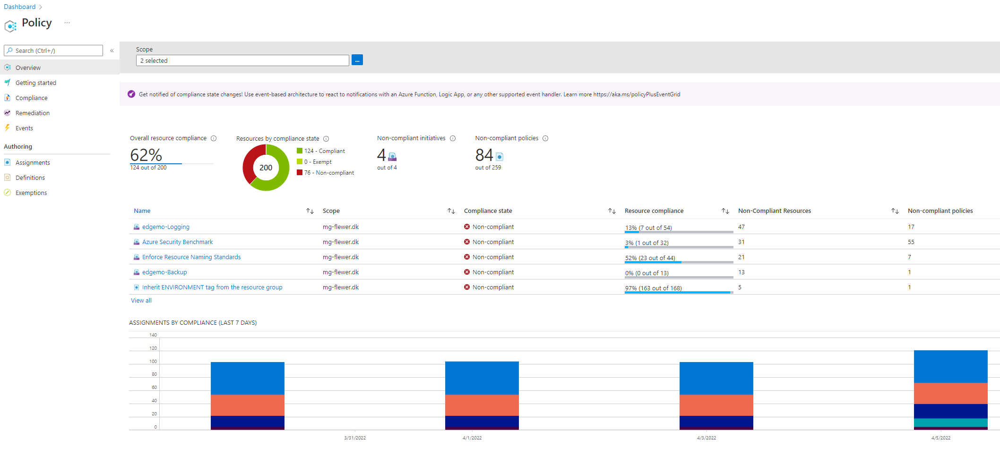
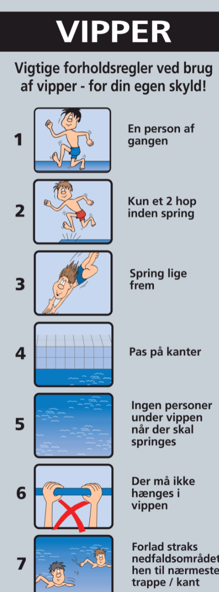
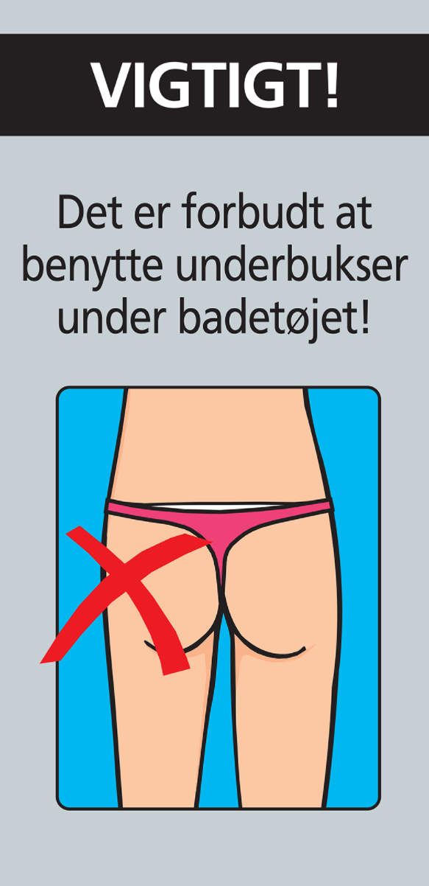
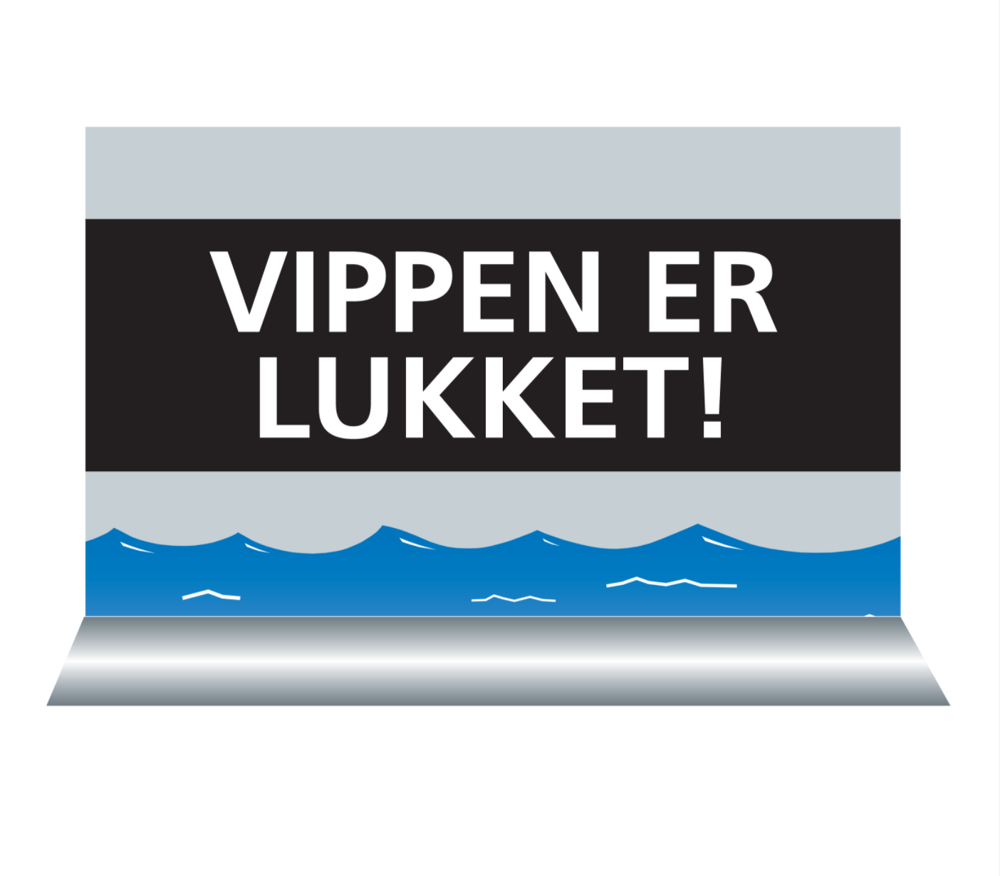

# Azure Policy

---
 

## Hvorfor har vi brug for Azure Policy?

---
 

## Hvorfor har vi brug for Azure Policy?
- Der skal være regler for leg i svømmehallen

---
 

## Hvorfor har vi brug for Azure Policy?
- Der skal være regler for leg i svømmehallen

---
 

## Hvorfor har vi brug for Azure Policy?
- Der skal være regler for leg i svømmehallen
- Azure Policy er bademesteren

---
 

## Hvorfor har vi brug for Azure Policy?
- Der skal være regler for leg i svømmehallen
- Azure Policy er bademesteren
  - Og bademesteren siger...

---
 

## Hvorfor har vi brug for Azure Policy?
- Eller sagt på en anden måde...

---
 

## Hvorfor har vi brug for Azure Policy?
- Azure Policy er vores "guard rails", som sikrer:

---
 

## Hvorfor har vi brug for Azure Policy?
- Azure Policy er vores "guard rails", som sikrer:
  - Compliance

---
 

## Hvorfor har vi brug for Azure Policy?
- Azure Policy er vores "guard rails", som sikrer:
  - Compliance
  - Cost

---
 

## Hvorfor har vi brug for Azure Policy?
- Azure Policy er vores "guard rails", som sikrer:
  - Compliance
  - Cost
  - Security

---
 

## Azure Policy - praktiske eksempler
- Security: Deny public IP

---
 

## Azure Policy - praktiske eksempler
- Security: Deny public IP
- Security: Enforce logs

---
 

## Azure Policy - praktiske eksempler
- Security: Deny public IP
- Security: Enforce logs
- Cost: Deny specific VM types

---
 

## Azure Policy - praktiske eksempler
- Security: Deny public IP
- Security: Enforce logs
- Cost: Deny specific VM types
- Compliance: Enforce location (EU GDPR)

---
 

## Azure Policy - praktiske eksempler
- Security: Deny public IP
- Security: Enforce logs
- Cost: Deny specific VM types
- Compliance: Enforce location (EU GDPR)
- Management: Enforce tags, inherit tags

---
 

## Azure Policy - praktiske eksempler
- Security: Deny public IP
- Security: Enforce logs
- Cost: Deny specific VM types
- Compliance: Enforce location (EU GDPR)
- Management: Enforce tags, inherit tags
- Management: Enforce Backup (DeployIfNotExist)

---
 

## Azure Policy - praktiske eksempler
- Security: Deny public IP
- Security: Enforce logs
- Cost: Deny specific VM types
- Compliance: Enforce location (EU GDPR)
- Management: Enforce tags, inherit tags
- Management: Enforce Backup (DeployIfNotExist)
- Management: Audit for irregularities 
              (ex. computername different from VM name)

---
 

## Azure Policy - Demo
- Deny public IP
- Enforce location
- Resource Naming
- Backup tag

---
 

## Azure Policy demo 
### - byggeklodser
- Policy Definitions
- Policy Initiatives
- Policy Assignments
- Non-compliance messages
- Exclusions
- Exemptions

---
 

## Azure Policy demo 
### - lidt dybere...
- Policy Effects
  - Deny
  - Audit
  - Modify (tags)
  - Append (add properties)
  - DeployIfNotExist

---
 

## Azure Policy demo 
### - dybere endnu...
- PolicyRules
- Parameters
  - Strongtypes
  - DefaultValues
  - PortalReview
- Initiative Parameters

---
 

## Azure Policy demo 
### - tror vi holder her!
- Deployment Scopes
  - ResourceGroup scope
  - Subscription Scope
  - Nested templates
- VsCode Plugin

