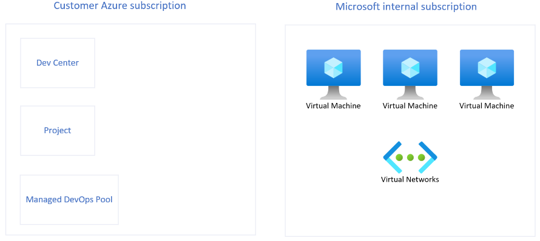

# Developer Experience

---
 
 

# Disclaimer:

### Jeg sætter ting lidt på spidsen nu...

---
 

### Applikationsudvikling i Azure

- Tidlig udvikling i Azure = "Cowboy Land"
  - Public endpoints på det meste
  - Udbredt brug af secrets
  - Manglende governance
- Funktionalitet og udviklingstid er altafgørende!
- Ofte eksterne udviklere tilknyttet

---
 

### Azure møder IT-drift & sikkerhed

- NIS2, CIS, NIST etc.
  - sikkerhedskrav til infrastruktur
  - Streng governance

---
 

### Azure møder IT-drift & sikkerhed

- Enterprise Scale architecture
  - Secure Hub & Spoke networks
  - Private Networking & Managed Identities

---
 

### Azure møder IT-drift & sikkerhed

- Krav til udviklingsmaskiner
  - Kontrolleret adgang til source-code
  - Conditional Access (compliant device)

---
 

### Azure møder IT-drift & sikkerhed

- Krav til udviklingsmaskiner
  - Kontrolleret adgang til source-code
  - Conditional Access (compliant device)
- Behov for standard-løsninger
  - Pre-approved templates

---
 

### Azure møder IT-drift & sikkerhed

- Applikationsudvikling bliver bøvlet
  - Taler vi overhovedet samme sprog??

---
 

### Azure møder IT-drift & sikkerhed

- Udviklerne går i stå,
  venter på hjælp i driften...
- Udviklingstiden bliver for lang!

---
 

### Platform Engineering

- Next Level Infrastructure Engineers
- Fortolkere ml. klassisk infrastruktur og udviklerne
- Ansvar for drift og udvikling af Azure som platform
- Udviklingsteams er dine vigtigste kunder!

---
 

### Internal Developer Platform

- Stil værktøjer til rådighed for udviklerne!
  - DevOps, Pipelines, Git, Nuget osv
  - Pre-approved application architectures

---
 

### Internal Developer Platform

- Stil værktøjer til rådighed for udviklerne!
  - DevOps, Pipelines, Git, Nuget osv
  - Pre-approved application architectures
- Formålet er at effektivisere udvikling!

---
 

### Internal Developer Platform

- Stil værktøjer til rådighed for udviklerne!
  - DevOps, Pipelines, Git, Nuget osv
  - Pre-approved application architectures
- Formålet er at effektivisere udvikling!
- Drives af Platform Engineering
  - Sikrer der udvikles med rette værktøjer og principper

---
 

### Internal Developer Platform

- Eksempler på funktionalitet i IDP:
  - Nye Landing Zones
  - Spoke-network m. peering til hub
  - Nye DevOps projekter
  - Håndtering af app-registrations (as code)
  - Deployment af reference-arkitekturer

---
 

### Internal Developer Platform

- Eksempler på funktionalitet i IDP:
  - Nye Landing Zones
  - Spoke-network m. peering til hub
  - Nye DevOps projekter
  - Håndtering af app-registrations (as code)
  - Deployment af reference-arkitekturer
- Self-service og automatiseret!

---
 

### Internal Developer Platform

- Tænk IDP som et produkt!

- Produktet skal "sælges" overfor udviklerne
  - Ellers finder de andre veje...

---
 

### Azure Developer Portal

##### Self-service portal for udviklere

- DevBox - administreret udviklermaskine
  - Internt/kendt netværk
  - Intune compliant device
  - IP-based Conditional Access (DevOps/Git)
  - Cost-optimized:
    - Automatisk lukning på klokkeslet
    - Hibernate on disconnect

---
 

### Azure Developer Portal

##### Self-service portal for udviklere

- Azure Deployment Environments
  - Opret "godkendte" referencearkitekturer
    - Eks. "Azure Function m. SQL Backend og Key Vault"
           Konfigureret på privat netværk, private dns zones records etc.
  - Sæt udløbsdato på Dev/Test-miljøer
  - Redeploy eller nedlæg miljøer

---

---
 

### Demo

- New Environment
  - Enable Scheduled Deletion
  - Select options (defined in Bicep)
- Udsæt planlagt sletning
- Gennemgå deployed resources
  - View Environment Resources (Dev Portal)
  - SQL, Networking + Firewall
  - SQL, Query Editor (denied)

---
 

### Demo

- New Dev Box
  - DevBoxes fra projekter tildelt mig
  - (admin-defineret) grænse for antal Dev Boxes, pr projekt
  - Apply Customizations
    - Find i DevOps projekt/Git
    - Genereret af Platform Engineering Team
    - Eller individuelle developer teams

---
 

### Demo

- Brug af Dev Box
  - https://portal.azure.com
  - SQL DB Query (Access allowed)
    SELECT name FROM sys.database_principals
  - Azure Key Vault secrets
  - Udsæt/annuller planlagt nedlukning

---
 

#### Flere fede features...

- Managed DevOps Pools
  - Self-hosted DevOps Agents w. Private Networking!
- Custom DevBox Images
  (Azure Compute Gallery)

---
 

#### Jeg skal lige nå at tale om...

- DevBox Licensing: 
  - M365 E3 osv (som AVD)
  - Ingen guest acconts
- DevBox pricing (8 CPU/32GB):
  - Ca. 10 kr/time + 150 kr storage
  - Max ca. 1150 kr/md hvis tændt 24/7

---
 

### Demo

##### Azure Deployment Environments 

- Hvis der er tid :-)
  - Gennemgang af DevCenter
  - Gennemgang af Projekt
    - Projekter assignes med RBAC til brugerne
