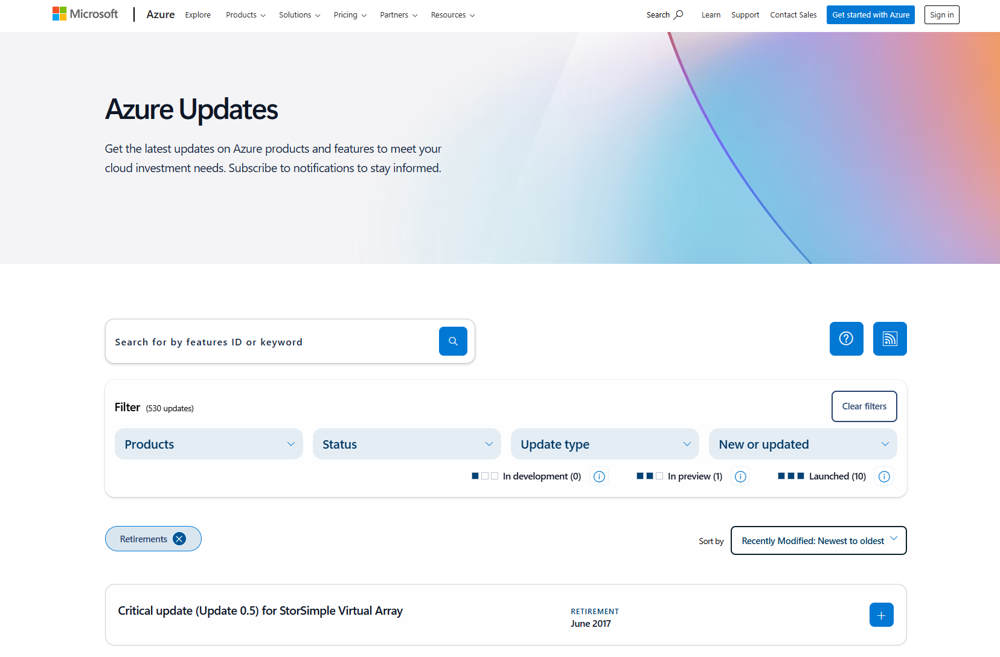
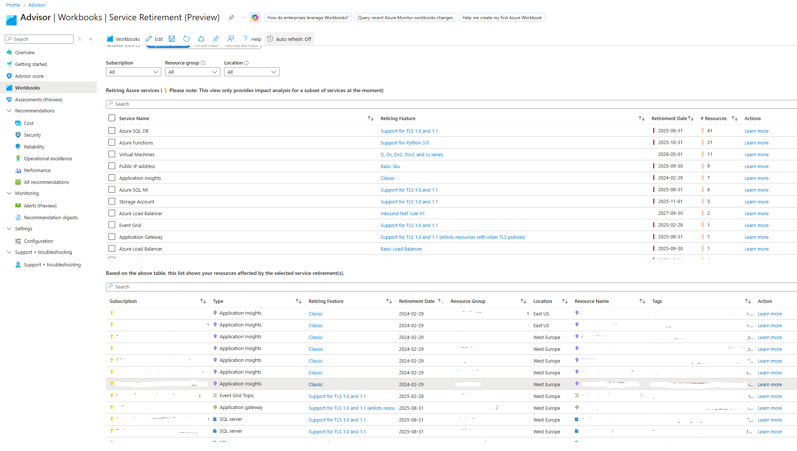

25.09.2025

 
 

## Service Retirement i Azure

---

 

### Service Retirement
 • Overblik
 • Eksempler på Service Retirements
 • Hvordan håndteres de?

---

 

#### Overblik   

Service Retirement dækker over de Azure Updates, der annoncerer udfasning af specifikke Azure-tjenester eller -funktioner.
Azure Updates - https://azure.microsoft.com/en-us/updates?filters=%5B%22Retirements%22%5D

 

 

---

 

#### Overblik

Som en del af Azure Advisor - findes Service Retirement workbook
https://portal.azure.com/#view/Microsoft_Azure_Expert/AdvisorMenuBlade/~/workbooks

 

 

---

 

#### Eksempler på Service Retirements

Basic SKU Public IP - 30/9-2025
Basic Load Balancer - 30/9-2025
VPN Gateway Standard/Performance - 30/9-2025
TLS 1.0/1.1: Storage Account - 1/11-2025
TLS 1.0/1.1: Application Gateway - 31/8-2025
TLS 1.0/1.1: Azure SQL Database - 31/8-2025

 

---

 

#### Hvordan håndteres de? - kortsigtet

Identificer berørte ressourcer - enten via workbook eller Azure Resource Graph Explorer

 

---

 

#### Hvordan håndteres de? - kortsigtet - Storage Account

TLS 1.0/1.1: Storage Account (1/11-2025) - DEMO

 

---

 

#### Hvordan håndteres de? - kortsigtet - Storage Account

Løsning - Azure Policy - DEMO

 

---

 

#### Hvordan håndteres de? - kortsigtet - App Services

TLS 1.0/1.1: App Services (ikke EOS/EOL endnu, men...) - DEMO

 

---

 

#### Hvordan håndteres de? - kortsigtet - App Services

Løsning - Azure Policy - DEMO

 

---

 

#### Hvordan håndteres de? - kortsigtet - Basic Public IP

Basic Public IP (30/9-2025) - DEMO

 

---

 

#### Hvordan håndteres de? - kortsigtet - Basic Public IP

Løsning - detach Public IP fra ressource, opgradér til Standard SKU (IP adresse fastholdes)

 

---

 

#### Hvordan håndteres de? - langsigtet - OS Disks

Eksempel: OS Disks running Standard HDD - retires 8-9-2028 - kan give service disruption ved konvertering

 

---

 

#### Hvordan håndteres de? - langsigtet - OS Disks

Hindre nye deployments - Deny policy - DEMO

 