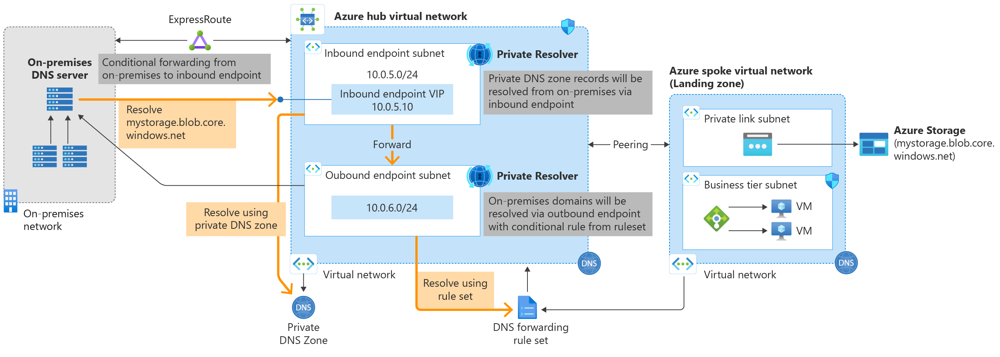
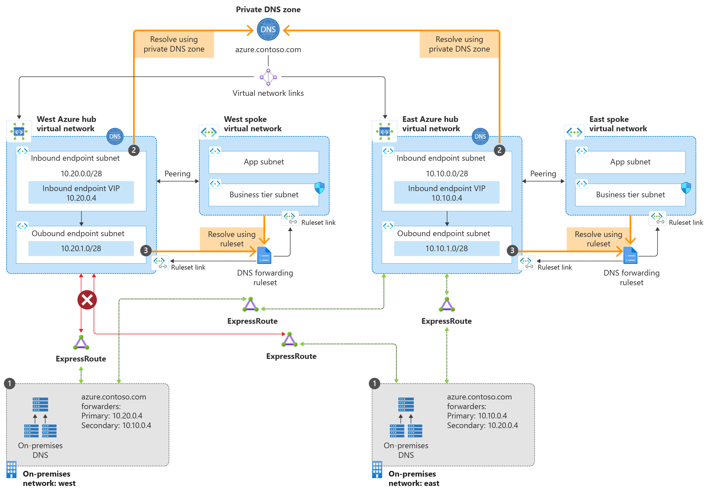
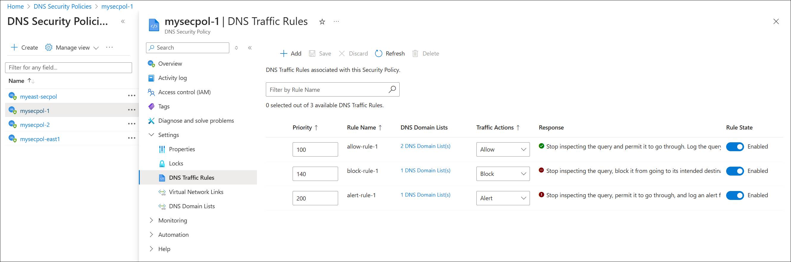

25.09.2025

 
 

## Azure DNS

---

 

## Private DNS

- Removes the need for custom DNS solutions.
- Use all common DNS records types. Azure DNS supports A, AAAA, CNAME, MX, PTR, SOA, SRV, and TXT records.
- Automatic hostname record management.
- - Default suffix internal.cloudapp.net
- Hostname resolution between virtual networks.
- Split-horizon DNS support. 
- DevOps Friendly: Build your pipelines with Terraform, ARM, or Bicep.

---

 

### Private DNS HUB Shared Private Zone

</img>

---

 

### Private DNS HUB Shared Private Zone

</img>

---

 
 

### Private DNS Resolver

- Fully managed: Built-in high availability, zone redundancy.

- Cost reduction: Reduce operating costs and run at a fraction of the price of traditional IaaS solutions.
- Private access to your Private DNS zones: Conditionally forward to and from on-premises.
- Scalability: High performance per endpoint.
- DevOps Friendly: Build your pipelines with Terraform, ARM, or Bicep.

--- 
 

### Private DNS Private resolver

---

 

### Private DNS Private resolver

---
 

### Private DNS Regional failover

---

 

 

# DNS Security limitation

| Restriction Type	| Limit / Rule |
|:------------------| :------------|
Virtual network restrictions	|- DNS security policies can only be applied to VNets in the same region as the DNS security policy.   -You can link one security policy per VNet.|
| Security policy restrictions |	1000 |
| DNS traffic rule restrictions	| 100 |
| Domain list restrictions | 2,000 |
| Large Domain list restrictions |	100,000|
| Domain restrictions | 100,000 |

---
 

 

# Pricing

| Resource |Price DKK|
|:-------------------------|:-------------|
|**Private DNS Resolver**|
|Azure DNS Private Resolver inbound endpoint|1.160 / month|
|Azure DNS Private Resolver outbound endpoint|1.160 / month|
|Azure DNS Private Resolver rulesets (1) | 16 / month|
|**DNS Security Policy**|
|Queries (when rules are configured)| 3,9 per million queries|
|Domain Lists 1.000 domains in a domain list| 3,2 / month |
|**DNS**|
|First 25 hosted DNS zones|3,2 per zone / month|
|First billion DNS queries/month| 2,57 / million|
