
25.09.2025

 
 

# Notes from the field 
# (Flewers Rodekasse)

---

## TOPICS

- Bicep "Next Level"
  - Graph extension
  - Experimental features
  - Next-level type-declarations
    - @discriminator property
    - resourceInput<'resourceprovider'>
  - Bicep Artifacts (versioning)

---

## TOPICS

- VsCode tips
  - VsCode Tasks
  - Devops Pipeline extension
- Azure Devops tips
  - Managed Agent Pools
  - Pull Request template
  - Pull Request Build validations
  - Pipeline & Agent pool security

---

## TOPICS

- Azure Devops tips
  - Managed Agent Pools
  - Pull Request Build validations
  - Pipeline & Agent pool security

---

## Bicep Next Level

**Graph Extension** (GA nu!)
`extension  
'br:mcr.microsoft.com/bicep/extensions/microsoftgraph/v1.0:1.0.0'`
(line wrapped)
`resource eIdGroup 'Microsoft.Graph/groups@v1.0' = `

Demo:
*entraIdGroup.bicep*
*main.bicep*
*Portal*

---

## Bicep Next Level

**Experimental features:**
https://github.com/Azure/bicep/blob/main/docs/experimental-features.md

- Konfigureres i bicepConfig.json

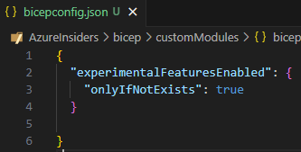

---

## Bicep Next Level

**@onlyifnotexists decorator**  
- Experimental i dag 
- På vej til GA

Demo:
*keyVault.bicep*
*main.bicep*
*Portal*

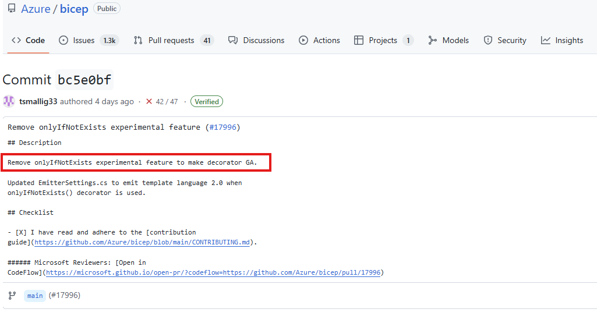

---

## Bicep Next Level

**@discriminator decorator**

- Multi-path type-declarations
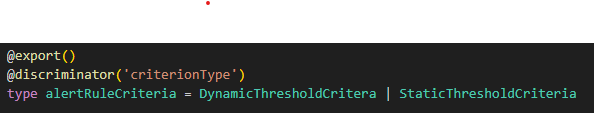

Demo: 
*bicepTypes.bicep*
*main.bicep*

---

## Bicep Next Level

**resourceInput function**
- Easy type declarations
- Pull from API
`type MyType = resourceInput<'resourceprovider'>.properties`  

Demo:
*main.bicep*

---

## Bicep Next Level

**Bicep Artifacts**
- Simpel versionering af Bicep moduler
- Undgå "breaking changes" i kørende pipelines
- Minder om NuGet pakker  

`az artifacts universal`

Demo:
*Create new artifact* (pipeline)
*Download artifact*

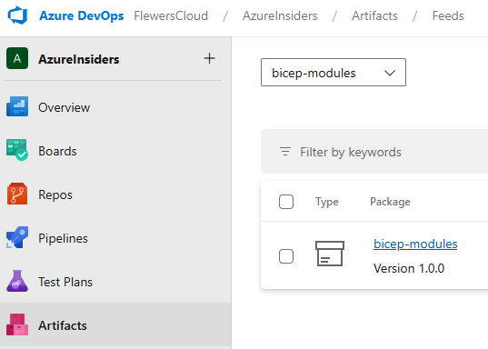

---

## VsCode tips

**VsCode Tasks**
- Configure tasks
- `<vscode-start-directory>\.vscode\tasks.json`
- Run commands or scripts
- Use the Run task command

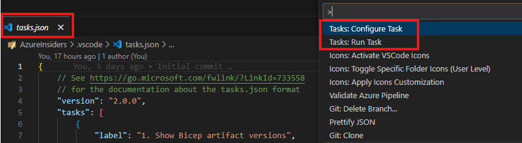

---

## VsCode tips

**Azure Devops Pipeline extension**
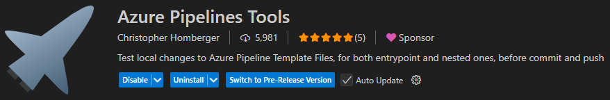
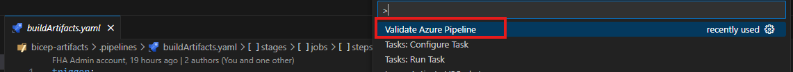
Demo:
*buildArtifacts.yaml*

---

## Azure Devops tips

**Managed Agent Pools**

- Virtual Network injection
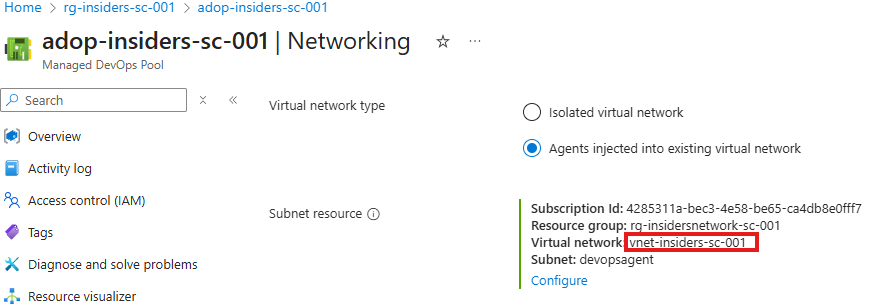
- Agent state
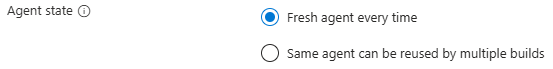

Demo:
*buildArtifacts.yaml*

---

## Azure Devops tips

**Pull Request Template**

- Markdown template
- Tjekket ind i repo
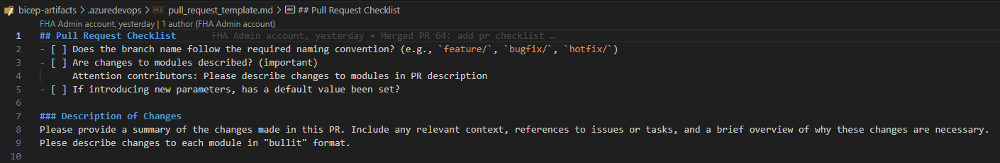
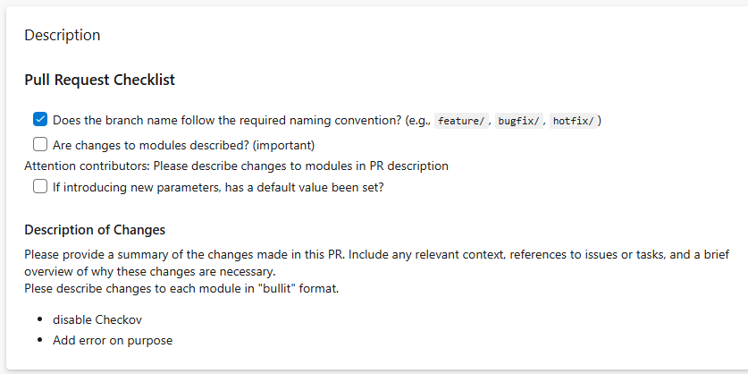

---

## Azure Devops tips

**Pull Request Build validation**

- Branch policy
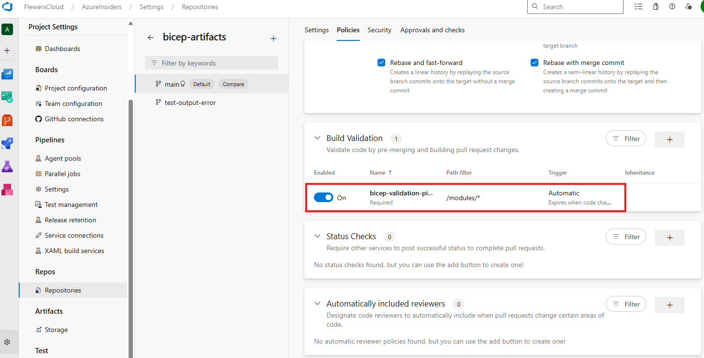

---

## Azure Devops tips

**Pull Request Build validation**
- Validering af kode
  - INDEN det tjekkes ind i main
- Eks. Bicep linting

Demo:
*bicep-validation.yaml*
*pull requests -> bicep-artifacts -> abandoned*
*pipelines -> bicep-validation*

---

## Azure Devops tips

**Required YAML template**

- Kan sættes som krav på service connections & agent pools
- Kræv extends fra et repo som vi har styr på
- Eks. en Bicep deployment pipeline extend

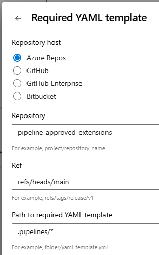

---

## Azure Devops tips

**Using pipeline extends**

- Pipeline benytter agent pool og service connection
- Begge er privilegerede
- Pipeline extend kontrollerer præcist, hvad der må afvikles
- Extend ligger i et begrænset repository

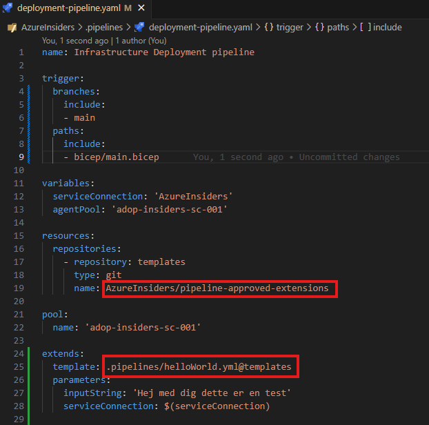

---

## Azure Devops tips

**Using pipeline extends**

*Failed template check*
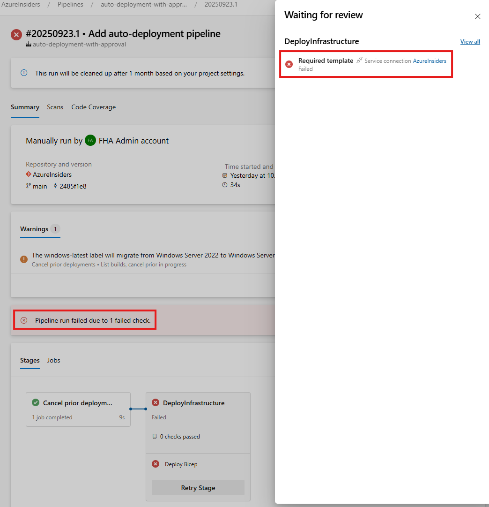