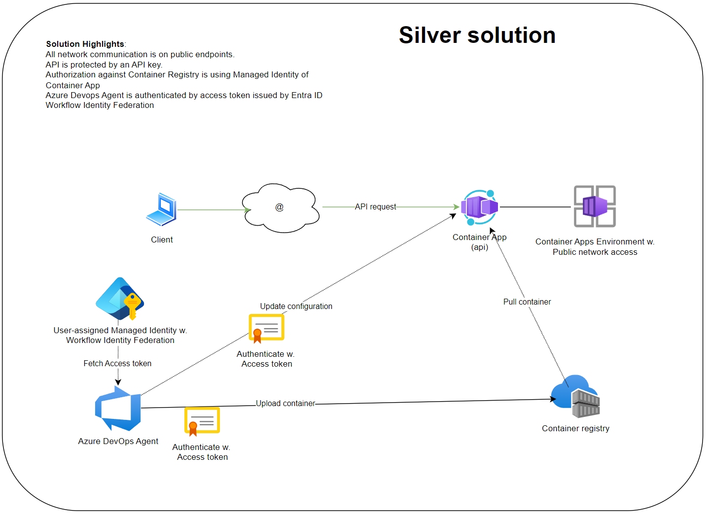
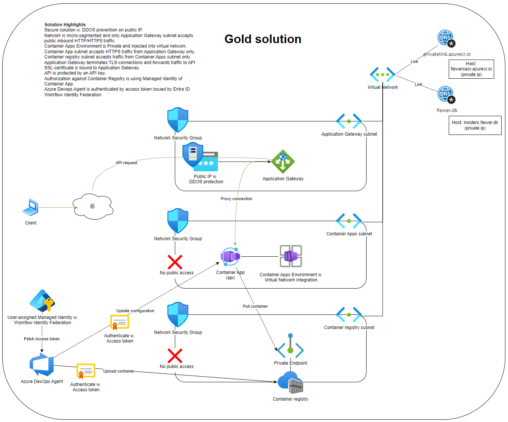
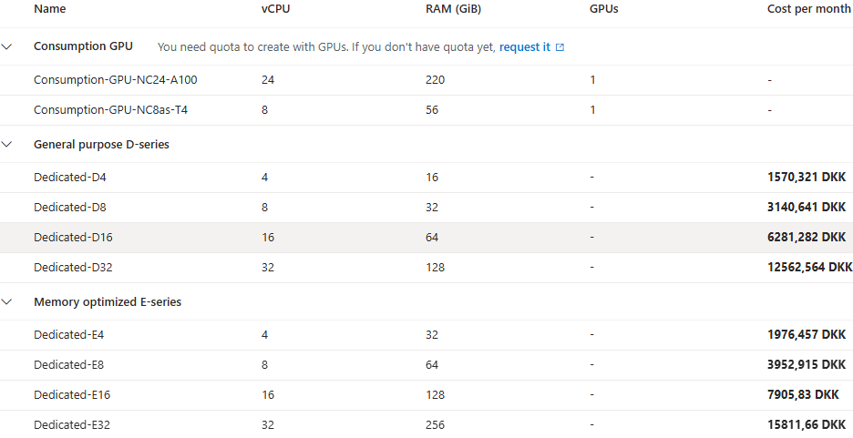
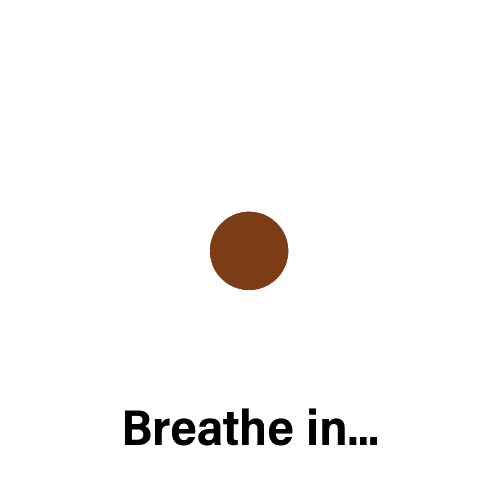

27.03.2025

 
 

# Flewers Rodekasse

---

AGENDA

- Azure container Apps
  - Introduktion
  - Demo
- Entra ID & Conditional Access Tools
  - Conditional Access Review
  - Risky Service principals
  - Entra ID Security as Code
  
---

Azure Container Apps

### Hvad er Azure Container Apps?

- Serverless container platform
- Ingen infrastruktur at vedligeholde
- "Abstraktionslag" ovenpå Kubernetes
- Auto scale - scale to 0 (consumption only)
- Ingress controller
- Mega fedt i micro-service workloads

---

Azure Container Apps - simple

---

Azure Container Apps - demo environment

---

Azure Container Apps

### Environment types

- Consumption Only (legacy)
  - Kræver et /23 subnet for in- and outbound
  - Understøtter ikke UDR's/Azure Firewall
- Workload Profiles
  - Kræver kun /27 subnet for in- and outbound
  - Krav for at bruge private endpoints
  - Understøtter outbound via Azure Firewall
  - Gå altid med denne

---

Azure Container Apps

### Workload Profiles

- Consumption profile er default
  - Betal kun for forbrug
  - Op til 4vCPU/8GB RAM
- Flere workload profiles
  - Consumption (GPU)
  - Dedicated
- Apps "deler" profile

---

Azure Container Apps

### Networking modes

- External Mode
  - Public Access enabled or disabled, can be changed
  - Uses public endpoint only, supporting fw rules
  - Public IP w. load balancer in selected subnet, in managed resource group
- Internal Mode:
  - Public access is disabled, internal load balancer only
  - Required for private endpoints

---

Azure Container Apps

### Ingress Controller

- Begræns til trafik internt i Container Apps Environment.
  - Brugbart ifm. tiering approach hvor kun 1-2 apps behøver være tilgængelige udenfor miløjet
- Understøtter client certificate
- Set target port (container's port)

---

Azure Container Apps

### Container revisions

- Single Revision Mode
  - Container "varmes op"
  - Fallback ved fejl i opstart
  - Zero downtime, men ingen brugertest
- Multiple Revisions Mode
  - Styr selv skift til ny container version
  - Traffic selection eller labels

---

Azure Container Apps

### AppGateway "good to knows"

- Health probes starter containers v. Scale to 0
  - Sæt timeout lang nok til at afvente container start
  - Sæt probe interval højt så den ikke auto-starter så ofte
- Traffic selection er ikke så brugbart
  - Revision endpoints skifter ved hver update
  - kun til "Canary" approach
- Label-based er brugbar
  - Opret ekstra backend pool

---

Azure Container Apps

### DEMO

- Container Apps Environment walk-through
- Container App walk-through
  - Scale
  - Revisions and Replicas
  - Traffic selection, labels
- 4 websites (browser profile)
  - Single, Multi, staging, production

---

Azure Container Apps

### DEMO

while ($true) {
	((invoke-webrequest -uri "https://insiders-single.flewer.dk/").Content -split("`n"))[1]
	start-sleep -seconds 1
}

- Update application in server.js, text and version
- Observér pipeline & approval flow i blue/green deployment
  - Tjek App02 i portal (canary)

---

Breaker slide

---

Entra ID & Conditional Access Tools

### Conditional Access Review

- Conditional Access IQ
  - https://github.com/thetolkienblackguy/ConditionalAccessIQ
  - Track CA Policy changes
  - Find CA policies hvor BreakGlass ikke er excluded

---

Entra ID & Conditional Access Tools

### Demo - Conditional Access IQ

- Check BreakGlass accounts for exclusion:

Connect-MgGraph -Scopes @("Policy.Read.All","AuditLog.Read.All","Directory.Read.All","Application.Read.All")
Invoke-CAIQBreakGlassAssessment -UserId "breakglass1@example.com","breakglass2@example.com"

---

Entra ID & Conditional Access Tools

### Conditional Access Review

- Conditional Access Documenter
  - https://idpowertoys.merill.net/
  - DEMO!

---

Entra ID & Conditional Access Tools

### Conditional Access Review

- Eksempler på fundne uhensigtsmæssigheder:
  - Breakglass accounts ikke excluded fra alle policies
  - Service Accounts excluded fra MFA vha. gruppemedlemsskaber,
    men grupper ikke beskyttet
  - Legacy Auth ikke excluded for alle

---

Entra ID & Conditional Access Tools

### Risky Service Principals

- https://www.powershellgallery.com/packages/Invoke-EntraAppReport/0.1.0
- https://ourcloudnetwork.com/create-a-free-enterprise-app-permissions-report-in-microsoft-entra/

- [Link til tidligere rapport](C:/Users/FlemmingHjorthAnders/Downloads/EntraAppReport_2025-03-19_11-23.html)

- DEMO!

Invoke-EntraAppReport -outpath C:\temp

---

Entra ID & Conditional Access Tools

### Master tool!

- https://maester.dev
- Security hardening ift. Security Benchmark og meget mere
- DevOps pipeline til kontinuerlig overvågning
- Conditional Access What-If analyser
  - Reagér på ændringer/introducerede sårbarheder
  - https://maester.dev/docs/ca-what-if/
- Email rapport, send til Teams channel m.fl.

---

Entra ID & Conditional Access Tools

### DEMO - Maester tool

cd \Git\FlewersCloud\maester
connect-maester
invoke-maester

- Tjek rapporten!