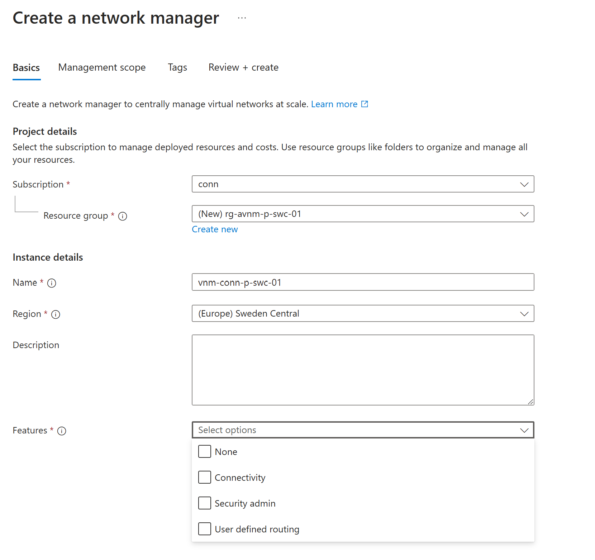
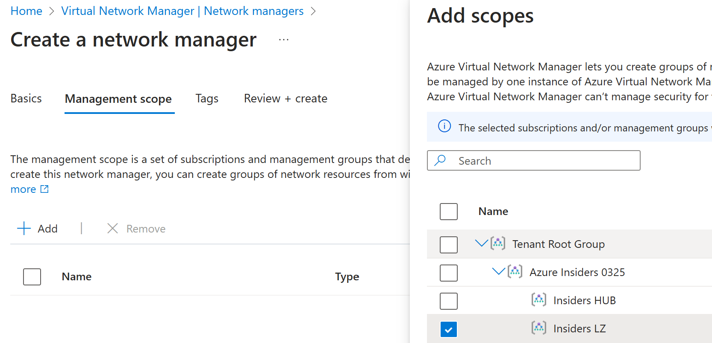
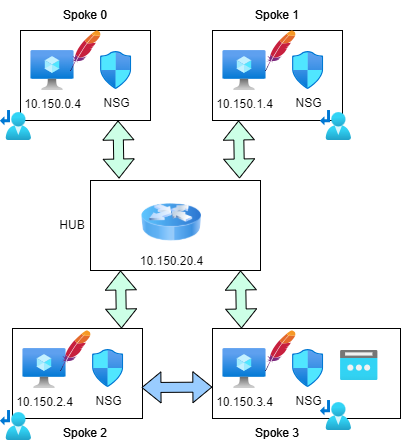
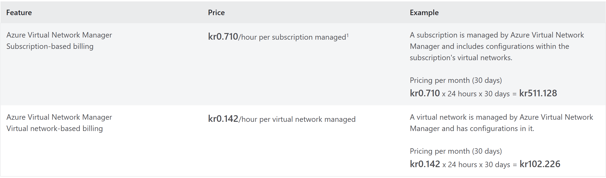

27.03.2025

 
 

## Azure Virtual Network Manager

---

<!-- backgroundImage: "linear-gradient(to bottom,rgb(11, 11, 11),rgb(44, 46, 47))" 
_color: "white"
-->

 
 

## Introduction to   Azure Virtual Network Manager (AVNM)

---
<!-- 
backgroundImage: url("./images/background.png") 
_color: black
-->

 
 
 

  <!-- Left side: Image -->
  

    
  

<!-- Right side: Bullet points -->
  

    <ul>
      <li>Manage connectivity</li>
      <li>Deploy Route table</li>
      <li>create network security rules that override network security group rules</li>
      <li>Supports multiple subscriptions and management groups</li>
    </ul>
  

---

<!-- 
backgroundImage: "linear-gradient(to bottom,rgb(11, 11, 11),rgb(44, 46, 47))" 
_color: "white"
-->

 
 

# Install and configure (AVNM)

---

<!-- 
backgroundImage: url("./images/background.png") 
_color: black
-->

 
 

---

 
 

---

 
 

<!-- 
backgroundImage: "linear-gradient(to bottom,rgb(11, 11, 11),rgb(44, 46, 47))" 
_color: "white"
-->

 
 

# Peering and Routing

---

<!-- 
backgroundImage: url("./images/background.png") 
_color: black
-->

 
 

---

 
 

---

<!-- 
backgroundImage: "linear-gradient(to bottom,rgb(11, 11, 11),rgb(44, 46, 47))" 
_color: "white"
-->

 
 

# Security admin rules

---

<!-- 
backgroundImage: url("./images/background.png") 
_color: black
-->

 
 

#### Security admin rules evaluation:

 

---

 
 

  ####  Security admin rules are not applied to vNet:
   

* Azure SQL Managed Instances
* Azure Databricks
  
---
 
 

  #### Security admin rules are not applied to subnets:
  * Azure Application Gateway
  * Azure Bastion
  * Azure Firewall
  * Azure Route Server
  * Azure VPN Gateway
  * Azure Virtual WAN
  * Azure ExpressRoute Gateway

---

 
 

---

 
 

---

<!-- 
backgroundImage: "linear-gradient(to bottom,rgb(11, 11, 11),rgb(44, 46, 47))" 
_color: "white"
-->

 
 

# Pricing

 

---

<!-- 
backgroundImage: url("./images/background.png") 
_color: black
-->

 
 

